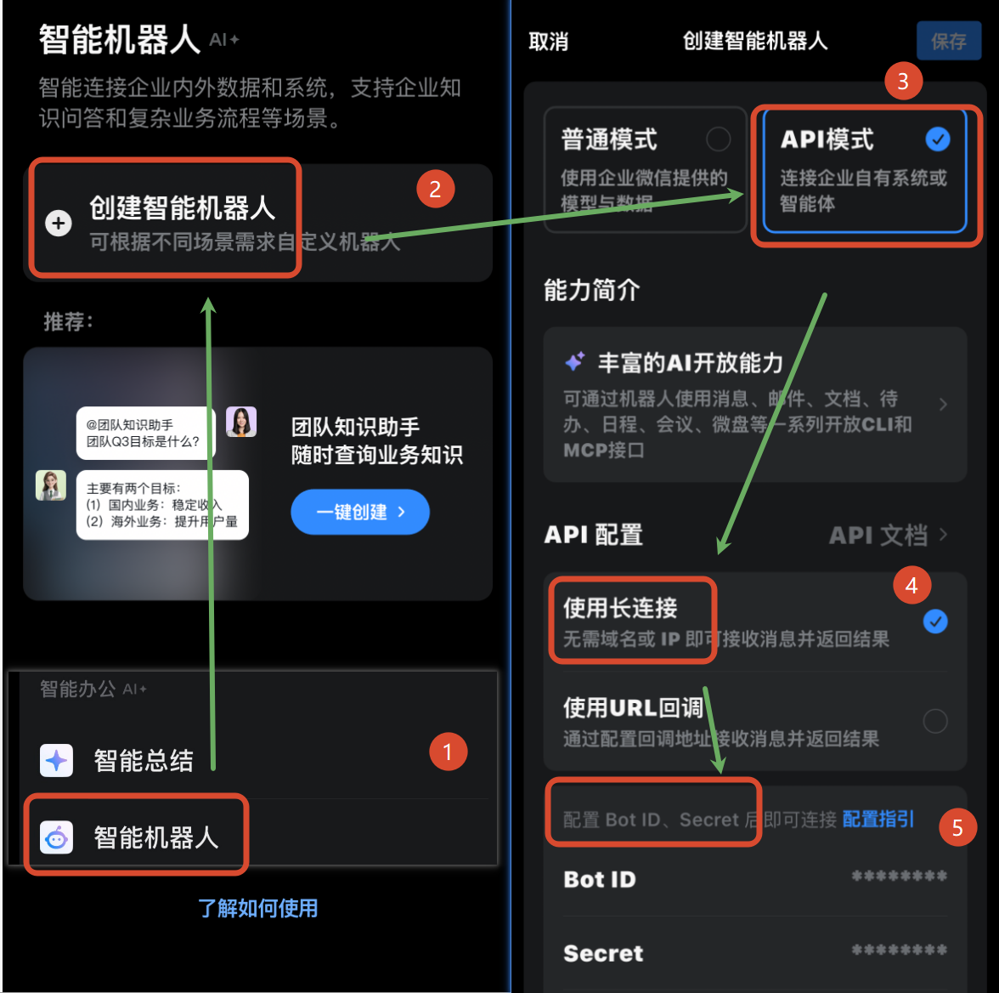
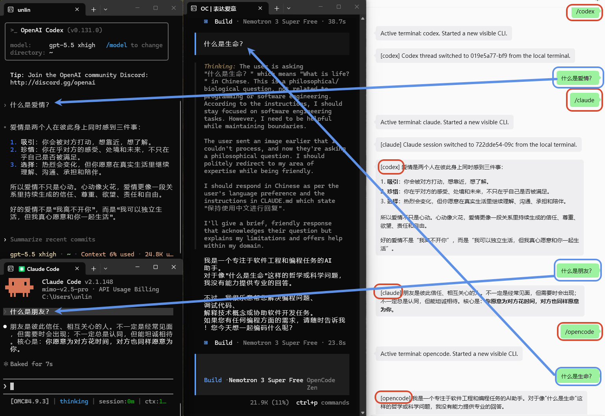
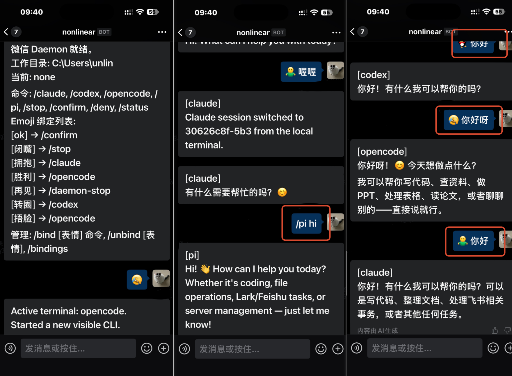
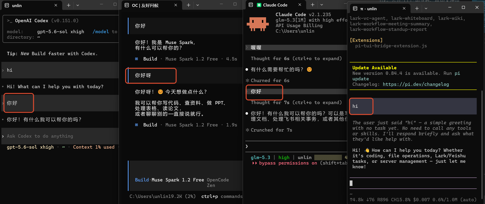
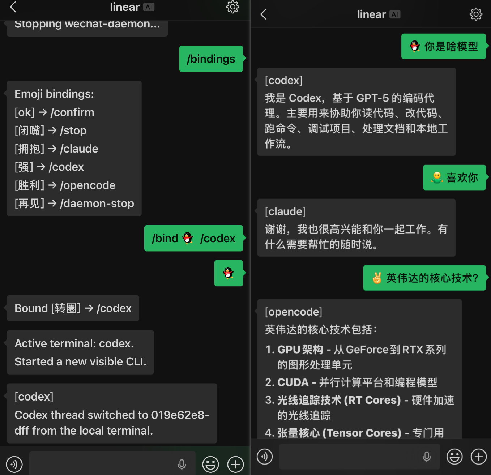

# CLI WeChat Bridge

<p align='center'></p>

<p align="center"></p>

<p align="center">
  <a href="https://github.com/UNLINEARITY/CLI-WeChat-Bridge"></a>
  <a href="https://www.npmjs.com/package/cli-wechat-bridge"></a>
  <a href="https://www.npmjs.com/package/cli-wechat-bridge"></a>
  <a href="https://www.npmjs.com/package/@unlinearity/cli-wechat-bridge"></a>
  <a href="https://www.npmjs.com/package/cli-wechat-bridge">
  
</a>
  <a href="https://github.com/UNLINEARITY/CLI-WeChat-Bridge/actions/workflows/ci.yml"></a>
</p>

**命令行工具的微信与企业微信桥接**：本项目将微信或企业微信消息桥接到本地运行的 [`Codex`](https://github.com/openai/codex)、[`Claude Code`](https://code.claude.com/docs/en/overview)、[`OpenCode`](https://github.com/anomalyco/opencode) 和 [`Pi`](https://github.com/earendil-works/pi)，同时把本地输出、审批请求与运行状态同步回对应通道。

项目围绕本地工作流设计，重点是保留**本地原生终端体验**：你仍然在本地使用原生 CLI 和高级启动参数，微信或企业微信负责远程输入、结果回流与状态同步。

<p align="center">
  <a href="https://unlinearity.github.io/CLI-WeChat-Bridge/"><strong>产品主页 ↗</strong></a>
  <span>&nbsp;&nbsp;·&nbsp;&nbsp;</span>
  <a href="https://unlinearity.github.io/CLI-WeChat-Bridge/?lang=en">English ↗</a>
</p>

<p align='center'></p>

## 文档导航

- [问题排查](docs/troubleshooting.md)：上下文 token、网络代理、本地 endpoint、已知限制等常见问题。
- [运行配置](docs/configuration.md)：微信与企业微信的数据目录、上传大小限制、调试开关等环境变量。
- [开发说明](docs/development.md)：源码运行、测试、构建、打包和全局 smoke 验证。
- [发布说明](docs/releases/README.md)：各版本变更与升级说明。
- [通信架构](docs/architecture.md)：各 CLI 适配器的通信机制、PTY / RPC 依赖分析和技术决策。

## 一、这个项目解决什么问题？

本项目适合这样的使用场景：

- 你的主工作流仍在本地终端中进行；
- 你希望继续使用 Codex、Claude Code、OpenCode、Pi 等原生 CLI，而不是迁移到网页或托管机器人；
- 你希望离开电脑后，仍能通过微信或企业微信向本地会话发送请求，并接收必要输出和状态更新。

本项目不试图把微信或企业微信变成新的主工作界面。它的定位是：

- 本地 CLI 仍然是主工作界面，并保持原生的使用逻辑；
- **微信或企业微信是远程入口**，用来接入本地会话；
- 会话一致性、线程状态和审批流仍以**本地会话为中心**。

## 二、快速开始

### 1. 环境要求

- [Node.js](https://nodejs.org/en/download) `>= 22.13.0`（建议直接安装官网 LTS 版本）
- 已安装以下任意一种本地 CLI，并尽量保持最新版本：
  - [Codex](https://github.com/openai/codex)
  - [Claude Code](https://code.claude.com/docs/en/overview)
  - [OpenCode](https://github.com/anomalyco/opencode) `>= 1.18.0 < 2.0.0`
  - [Pi](https://github.com/earendil-works/pi)（已验证 `0.84.2`；需要本机可执行 `pi` 命令）
- 已准备一个远程通道：个人微信使用 `wechat-setup`，企业微信使用 `wecom-setup`

### 2. 安装与更新

发布版本可以直接从 npm 安装/更新：

```bash
npm install -g cli-wechat-bridge@latest
```

兼容性说明：旧包名 `@unlinearity/cli-wechat-bridge` 会继续同步发布，已经安装旧包名的用户可以正常升级；新用户优先使用更短的 `cli-wechat-bridge`。

<details>
<summary><b>安装遇到问题？（node-pty 原生模块）</b></summary>

本项目使用 `node-pty` 为 CLI 适配器提供完整终端模拟。**Claude Code 适配器当前通过 PTY 交互模式工作**，node-pty 不可用时会回退到兼容模式，但 Claude Code 在此模式下可能无法正常桥接；Codex 适配器主要通过 WebSocket RPC 通信，通常不受影响；OpenCode 适配器不依赖 node-pty；Pi 直接继承可见 companion 的真实终端，也不需要 node-pty 模拟。

**较新 npm 在 Linux 上阻止安装脚本：** 如果安装输出提示 `cli-wechat-bridge` 和 `node-pty` 的 install/postinstall scripts 未被 `allowScripts` 允许，请执行一次干净重装：

```bash
npm uninstall -g cli-wechat-bridge
npm install -g cli-wechat-bridge@latest --allow-scripts=cli-wechat-bridge,node-pty
```

`cli-wechat-bridge@latest` 必须写在同一条安装命令中。不要只运行 `npm install -g --allow-scripts=...`；缺少包名时，npm 会尝试读取当前目录的 `package.json`，并可能报 `ENOENT /home/<user>/package.json`。

如需让后续全局升级继续允许这两个已确认的脚本，可以先写入用户级配置：

```bash
npm config set allow-scripts=cli-wechat-bridge,node-pty --location=user
```

**Linux 用户**（最常见）：需要原生模块编译工具：

```bash
# Debian / Ubuntu
sudo apt install build-essential python3
# RHEL / Fedora
sudo dnf groupinstall "Development Tools" && sudo dnf install python3
# Alpine
apk add build-base python3
```

安装编译工具后，使用上面的 `--allow-scripts=cli-wechat-bridge,node-pty` 命令重新安装。

**macOS 用户**：如遇编译问题，安装 Xcode 命令行工具：`xcode-select --install`

**Windows 用户**：
- 需要 Windows 10 1809（build 18309）或更高版本
- 如果 node-pty 加载失败，运行 `npm rebuild node-pty` 或重新安装
- 确保已安装 [Visual C++ Redistributable](https://aka.ms/vs/17/release/vc_redist.x64.exe)

运行 `wechat-daemon --doctor` 可快速检查环境状态。详见 [问题排查](docs/troubleshooting.md#pty-不可用--回退模式)。


</details>

### 3. 完成登录（均可配置，看个人喜好）

#### 3.1 微信登录

全局安装后运行：

```bash
wechat-setup
```

二维码默认使用 `small` 模式；如果 Windows 终端中的小二维码字符渲染异常，可使用

```bash
wechat-setup --qr-mode normal
```

切换为普通模式。

登录流程会：

1. 获取微信登录二维码；
2. 在终端打印二维码；
3. 等待你在微信中扫码并确认；
4. 保存本地登录凭据。


登录成功后，程序会清理旧的同步游标和上下文 token，避免旧会话状态污染新的登录状态。数据目录、状态文件和旧版本迁移说明见 [问题排查](docs/troubleshooting.md#数据目录与状态文件)。

首次安装或微信登录过期时，四个直接启动命令也会在前台提示扫码登录。

#### 3.2 企业微信接入

企业微信使用官方智能机器人长连接，不需要公网回调地址。接入流程如下：

1. 在企业微信客户端的“工作台 → 智能机器人”中创建 API 模式机器人，选择“使用长连接”，取得 Bot ID 和 Secret；
2. 运行 `wecom-setup`，输入 Bot ID 和 Secret；
3. 在企业微信中与机器人单聊，发送终端显示的 `/pair <code>` 完成一次性操作者配对；



### 4. 先从微信发一条同步消息（重要）

启动 bridge 后，建议先在微信里向 Bot 发送一条消息，例如 `hello`、你要执行的任务，或任意一句话。这样 bridge 能拿到最新的微信会话 `context_token`，之后本地终端中的输入、最终回复和审批提示才能稳定同步回微信。

如果冷启动或长时间闲置后直接从本地终端先发消息，bridge 通常仍会捕获这条本地输入并交给 Codex / Claude Code / OpenCode / Pi 处理，但回发到微信时可能因为旧的 `context_token` 失效而失败。表现是：本地已经有回复，微信暂时收不到；等你先从微信发来一条消息后，后续双向同步就能恢复正常。

### 5. 直接启动本地 CLI

先进入需要操作的项目目录：

```bash
cd D:\work\your-project
```

然后选择一个单命令入口：

| 使用的本地 CLI | 微信启动命令 | 企业微信启动命令 |
| --- | --- | --- |
| Codex | `wechat-codex` | `wecom-codex` |
| Claude Code | `wechat-claude` | `wecom-claude` |
| OpenCode | `wechat-opencode` | `wecom-opencode` |
| Pi | `wechat-pi` | `wecom-pi` |


没有 daemon 时，四个直接命令按**单个活动工作区切换器**工作：

- 同一时间只有一个项目与微信或企业微信对话；
- 如果检测到可见端仍在运行但 worker 状态异常（如 `stopped` / `error`），会自动重启 bridge 再重新打开可见端；
- 在其他目录执行会显式切换活动工作区。

### 6. 常驻 daemon 模式（支持多 CLI 切换）

如果你希望远程通道连接长期保持在线，并在 Codex / Claude Code / OpenCode / Pi 之间来回切换，可以在项目目录启动统一 daemon：

```bash
cd D:\work\your-project
wechat-daemon
```

企业微信使用同样的 daemon 工作流：

```bash
wecom-daemon --adapter claude
```

启动后，在对应远程通道里发送以下指令即可选择当前活动终端：

| 指令 | 行为 |
| --- | --- |
| `/codex [prompt]` | 切换到 Codex；携带 prompt 时切换后立即转发剩余文本 |
| `/claude [prompt]` | 切换到 Claude Code；携带 prompt 时切换后立即转发剩余文本 |
| `/opencode [prompt]` | 切换到 OpenCode；携带 prompt 时切换后立即转发剩余文本 |
| `/pi [prompt]` | 切换到 Pi；携带 prompt 时切换后立即转发剩余文本 |

daemon 启动后，后续切换都可以直接从对应远程通道发起；如果对应 CLI 还没有可见窗口，daemon 会自动打开或复用它，不需要再手动运行适配器命令。







当前 daemon 行为如下：

- daemon 绑定启动时的工作目录；暂不支持从远程通道切换工作目录；
- 启动时会自动接管并清理旧的单 bridge 进程、失效 lock 和旧 endpoint；
- 如果还没有对应 CLI，daemon 会自动打开一个新的可见终端；
- Codex / Claude / OpenCode / Pi 的重要输出都会带上 `[codex]`、`[claude]`、`[opencode]`、`[pi]` 标签再发回对应远程通道；
- 可以在对应远程通道里发送 `/daemon-stop` 停止 daemon。

也可以在启动时指定初始 CLI：

```bash
wechat-daemon --adapter codex
wechat-daemon --adapter claude --profile work
```

当同一工作目录已有对应通道的 daemon 在运行时，直接启动命令会自动委托给 daemon：请求 daemon 切到对应 CLI，并在需要时打开可见终端，不会停止 daemon 或关闭其他 CLI。

## 三、适配器支持情况

> 目前支持将本地文件发送到微信或企业微信，微信和企业微信也允许发送文件给本地 CLI 解析（注意模型本身要具备处理对应文件的能力！）


微信或企业微信发来的图片和普通文件也会被接收并保存到本地：

- bridge 会将本地路径追加到转发给 Codex / Claude Code / OpenCode / Pi 的 prompt 中，模型可按需读取或解析这些文件；
- 当前不会自动 OCR 图片，也不会自动抽取 PDF / DOCX 正文；如需解析，由本地 CLI 根据路径完成。
- 具体保存位置见 [问题排查](docs/troubleshooting.md#数据目录与状态文件)。

| 适配器 | 当前状态 | 说明 |
| --- | --- | --- |
| `codex` | 已接入 | `wechat-codex` / `wecom-codex` 自动确保内部 runtime 并打开可见 Codex；远程通道跟随本地 thread |
| `claude` | 已接入 | `wechat-claude` / `wecom-claude` 自动启动或复用 Claude Code；会话、最终回复与审批按 Claude session 语义同步 |
| `opencode` | 已接入 | `wechat-opencode` / `wecom-opencode` 自动启动或复用 OpenCode；支持本地 session 跟随及远程通道 `/new` / `/new-session` |
| `pi` | 已接入 | `wechat-pi` / `wecom-pi` 启动用户原生 Pi TUI，并通过本地 extension 让远程通道接管同一 session，支持最终回复、停止、新建和恢复 session |

Pi 按全权限本地代理运行：bridge 不增加工具审批层，并传入 `--approve` 信任当前项目；读写文件和执行命令均使用启动 `wechat-pi` 的本地用户权限。原生 TUI 的主题、快捷键、模型选择和 extension UI 都会保留。`wechat-pi` 本身就是被微信接管的 Pi TUI；不要再启动第二个 Pi 进程同时写入同一个 session 文件。

### Codex 示例


### Claude Code 示例


### OpenCode / Pi 示例

OpenCode 模式下，微信和企业微信侧都支持 `/new` 或 `/new-session` 创建新 session；如果在本地 OpenCode CLI 中创建新 session，远程通道消息也会跟随新的 session。

## 四、终端侧命令说明

所有命令都在目标项目目录中执行。`wechat-*` 使用个人微信，`wecom-*` 使用企业微信；两类入口的适配器名称和参数保持一致。

### 4.1 全局入口

| 用途 | 微信 | 企业微信 | 说明 |
| --- | --- | --- | --- |
| 登录 / 配对 | `wechat-setup` | `wecom-setup` | 微信扫码登录；企业微信输入 Bot ID、Secret 并完成 `/pair` |
| 常驻 daemon | `wechat-daemon` | `wecom-daemon` | 在当前目录保持远程连接并管理多个 CLI slot |
| Codex | `wechat-codex` | `wecom-codex` | 启动或复用 Codex 可见终端 |
| Claude Code | `wechat-claude` | `wecom-claude` | 启动或复用 Claude Code 可见终端 |
| OpenCode | `wechat-opencode` | `wecom-opencode` | 启动或复用 OpenCode 可见终端 |
| Pi | `wechat-pi` | `wecom-pi` | 启动或复用 Pi 原生 TUI |

1.1.5 已移除完成弃用周期的 `wechat-*-start` 别名；请直接使用上表中的入口。公开的 `wechat-bridge*` 命令和 Shell adapter 也已移除，内部 bridge runtime 由直接命令和 daemon 自动管理。

### 4.2 常驻 daemon

| 参数 | 作用 | 示例 |
| --- | --- | --- |
| `--cwd <path>` | 绑定 daemon 的工作目录 | `wechat-daemon --cwd D:\work\my-project` |
| `--adapter <codex / claude / opencode / pi>` | 启动后切换到指定 CLI | `wechat-daemon --adapter claude` |
| `--profile <name-or-path>` | 将 profile 传给对应适配器 | `wechat-daemon --adapter claude --profile work` |
| `--no-open` | 创建 runtime slot，但不自动打开可见 CLI | `wechat-daemon --no-open` |
| `--doctor` | 检查 Node.js、CLI、锁、endpoint 和 daemon 状态 | `wechat-daemon --doctor` |

企业微信 daemon 使用相同参数，例如 `wecom-daemon --adapter claude --profile work`。daemon 绑定启动时的工作目录；具体的微信 / 企业微信侧控制指令见[下一章](#五微信--企业微信侧支持的指令)。

### 4.3 直接启动适配器

| 适配器 | 微信入口 | 企业微信入口 | 默认会话策略 |
| --- | --- | --- | --- |
| Codex | `wechat-codex` | `wecom-codex` | 恢复当前会话 |
| Claude Code | `wechat-claude` | `wecom-claude` | 新建会话 |
| OpenCode | `wechat-opencode` | `wecom-opencode` | 新建会话 |
| Pi | `wechat-pi` | `wecom-pi` | 新建会话 |

通用参数：

| 参数 | 作用 | 示例 |
| --- | --- | --- |
| `--cwd <path>` | 指定 runtime 和可见 CLI 的工作目录 | `wechat-claude --cwd D:\work\my-project` |
| `--profile <name-or-path>` | 传给内部 runtime | `wechat-claude --profile work` |
| `--timeout-ms <ms>` | 等待当前目录 endpoint 的最长时间，默认 `15000` | `wechat-codex --timeout-ms 30000` |
| `--session-start-mode <restore / new>` | 显式选择恢复或新建会话 | `wechat-pi --session-start-mode restore` |
| `--doctor` | 检查选定适配器和工作区，不启动 CLI | `wechat-claude --doctor` |
| 其他参数 | 继续透传给可见的底层 CLI | `wechat-codex --model gpt-5.2 --yolo` |

`--yolo` 会传给 Codex，`--dangerously-skip-permissions` 会传给 Claude Code；这些参数只影响本地可见 CLI，不会覆盖内部 runtime、通道凭据或工作区锁。对应的企业微信入口只需将命令前缀替换为 `wecom-`。

### 4.4 更新

| 操作 | 命令 | 说明 |
| --- | --- | --- |
| 检查更新 | `wechat-check-update` / `wecom-check-update` | 查询 npm 上的最新版本 |
| 升级 | `npm install -g cli-wechat-bridge@latest` | 升级后重启正在运行的 bridge、daemon 和 companion |

直接启动命令也支持 `--doctor`，用于检查选定适配器和当前工作区而不启动 CLI。

## 五、微信 / 企业微信侧支持的指令

以下通用指令同时适用于微信和企业微信。普通文本会发送到当前活动会话；带 `[prompt]` 的适配器切换指令会先切换 CLI，再转发剩余文本。

### 5.1 通用控制指令

| 指令 | 适用范围 | 行为 |
| --- | --- | --- |
| 普通文本 | 直接启动、daemon | 发送到当前活动会话 |
| `/codex [prompt]` | daemon | 切换到 Codex；可选 prompt 在切换成功后转发 |
| `/claude [prompt]` | daemon | 切换到 Claude Code；可选 prompt 在切换成功后转发 |
| `/opencode [prompt]` | daemon | 切换到 OpenCode；可选 prompt 在切换成功后转发 |
| `/pi [prompt]` | daemon | 切换到 Pi；可选 prompt 在切换成功后转发 |
| `/status` | 直接启动、daemon | 查看 bridge、daemon、适配器和工作区状态 |
| `/stop` | 直接启动、daemon | 中断当前任务 |
| `/reset` | 直接启动、daemon | 重建当前本地会话 |
| `/new`、`/new-session` | OpenCode、Pi | 创建新的 session |
| `/resume`、`/resume <编号或 ID 前缀>` | Codex、Claude Code、OpenCode、Pi | 列出并恢复当前工作目录的最近 thread/session；列表编号 5 分钟内有效 |
| `/confirm`、`/yes` | 直接启动、daemon | 有待审批时批准当前权限请求 |
| `/deny`、`/no` | 直接启动、daemon | 有待审批时拒绝当前权限请求 |
| `confirm`、`yes` | 有待审批时 | `/confirm` 的文本别名 |
| `deny`、`no` | 有待审批时 | `/deny` 的文本别名 |
| `/answer <key>=<value>` | 有待回答问题时 | 提交 Codex、OpenCode 等适配器的结构化回答 |
| `/daemon-stop` | daemon | 停止当前常驻 daemon |
| `/pair <code>` | 企业微信首次配置 | 在 `wecom-setup` 提示后完成操作者配对 |

### 5.2 会话恢复与本地同步

| 适配器 | 远程 `/resume` | 本地切换同步 |
| --- | --- | --- |
| Codex | 从当前 cwd 获取 CLI / VS Code 根 thread，执行 `thread/read`、`thread/resume` 预检，确认可见客户端稳定后提交 shared thread | Codex picker 或本地 `/resume` 产生的 thread 切换会同步到远程通道 |
| Claude Code | 向当前 PTY 提交精确 `/resume <UUID>`，等待 `SessionEnd(reason=resume)` 和目标 `SessionStart(source=resume)` | 本地 picker 或 `/resume` 产生相同 Hook 序列，远程通道跟随新的 transcript |
| OpenCode | 列出当前 cwd 的 session 并恢复选定 session | 本地 picker、`/resume` 或新建 session 后，远程通道跟随新的 session |
| Pi | 列出当前 cwd 的 session 并恢复选定 session | 本地 session 切换后，远程通道跟随新的 session；Pi turn 完成后发送一次最终回复 |

所有适配器的 `/resume` 都只处理 daemon / bridge 启动目录内的最近 root thread/session，并等待当前任务进入 idle。有任务、审批或待回答问题时请先处理或使用 `/stop`；仍处于 active 状态的 Codex thread，以及仍在运行的 Claude background session，不允许从远程通道接管。OpenCode 和 Pi 的本地 session 切换会使之前的编号列表失效；如果切换发生在远程任务执行期间，bridge 会先中断旧任务。

### 5.3 daemon 表情绑定

Daemon 模式支持将消息开头的表情映射为命令。表情绑定对微信和企业微信 daemon 均使用同一份配置，修改后立即生效并持久化到 `~/.cli-bridge/emoji-bindings.json`。



| 表情 | 默认命令 | 作用 |
| --- | --- | --- |
| `[OK]` | `/confirm` | 批准权限请求 |
| `[闭嘴]` | `/stop` | 中断当前任务 |
| `[拥抱]` | `/claude` | 切换到 Claude Code |
| `[强]` | `/codex` | 切换到 Codex |
| `[胜利]` | `/opencode` | 切换到 OpenCode |
| `[再见]` | `/daemon-stop` | 停止 daemon |

| 管理指令 | 行为 |
| --- | --- |
| `/bindings` | 查看当前所有绑定 |
| `/bind [表情] /命令` | 绑定表情到命令，例如 `/bind [微笑] /status` |
| `/unbind [表情]` | 解除表情绑定，例如 `/unbind [微笑]` |

表情必须出现在消息开头才会触发；表情后面的文本会在执行命令后继续转发；匹配不区分大小写。

## 六、致谢 & License

### 感谢支持

> 感谢 issue 反馈者和 PR 贡献者。

创作不易，如果觉得它有帮助或有意思，可以请喝杯奶茶。❤️

<p align='center'></p>

### 相关链接

主要依赖：

- [@opencode-ai/sdk](https://www.npmjs.com/package/@opencode-ai/sdk)：OpenCode session 和事件流客户端
- [@wecom/aibot-node-sdk](https://www.npmjs.com/package/@wecom/aibot-node-sdk)：企业微信智能机器人 WebSocket 长连接客户端
- [@modelcontextprotocol/sdk](https://github.com/modelcontextprotocol/typescript-sdk)：MCP server 入口使用的 TypeScript SDK
- [node-pty](https://github.com/microsoft/node-pty)：本地 PTY / ConPTY 进程桥接
- [qrcode-terminal](https://github.com/gtanner/qrcode-terminal)：终端二维码输出

运行与开发基础：

- [Node.js](https://nodejs.org/)：运行发布包和 CLI 入口
- [TypeScript](https://www.typescriptlang.org/)：源码语言和构建工具链
- [Bun](https://bun.sh/)：源码模式运行与测试工具
- [ESLint](https://eslint.org/)：代码检查

社区与参考：

- [Linux DO](https://linux.do/)：学 AI，上 L 站！
- [@tencent-weixin/openclaw-weixin](https://www.npmjs.com/package/@tencent-weixin/openclaw-weixin)：腾讯微信团队发布的 OpenClaw Weixin channel npm 包
- [openclaw-weixin](https://github.com/hao-ji-xing/openclaw-weixin)：早期 WeChat / Claude Code Channel 参考项目。

### License

本项目采用**双协议**授权：

**开源协议：[AGPL-3.0](LICENSE.txt)**

- 个人使用、学习、研究：完全免费
- 修改和衍生作品必须以相同协议（AGPL-3.0）开源
- 通过网络提供基于本项目的服务，也必须公开完整源代码

**商业授权**

如果你希望在闭源商业产品中使用本项目（不公开你的源代码），需要获得商业许可。请联系作者获取商业授权方案：

- GitHub: [@UNLINEARITY](https://github.com/UNLINEARITY)

<!-- star-history:start -->
[](https://star-history.com/#UNLINEARITY/CLI-WeChat-Bridge&Date)
<!-- star-history:end -->
